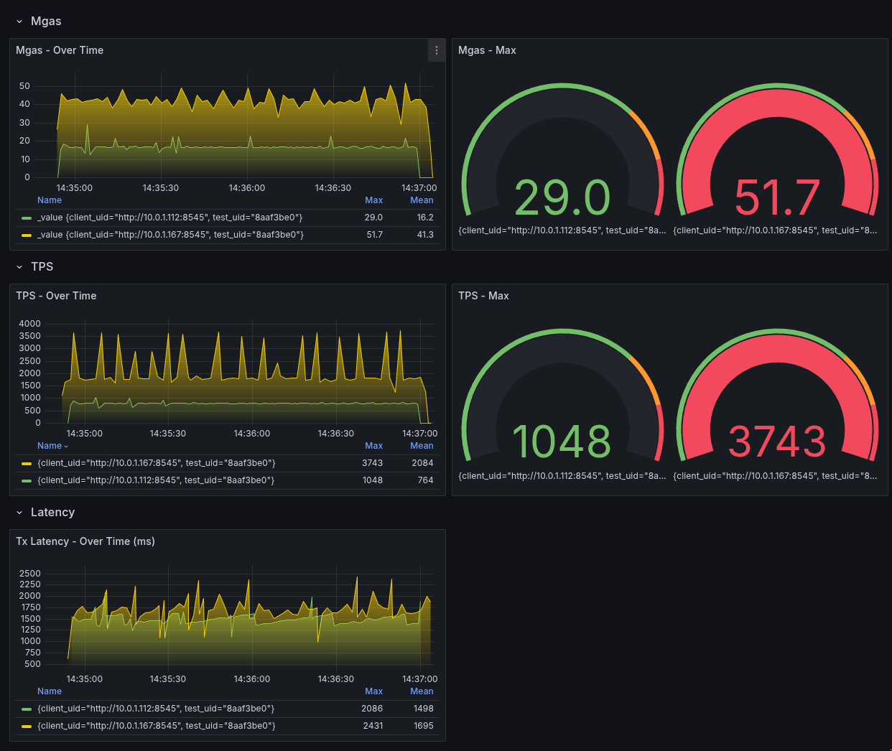

Moto: Marketable metrics. Engineer approved chaos.

# Gasper = MGas/s + throughput

A k6 extension for load testing Ethereum RPC nodes. Gasper allows you to simulate multiple wallets sending transactions concurrently to measure node performance and reliability.

## Table of Contents

- [Features](#features)
- [Prerequisites](#prerequisites)
- [Nix Development Environment](#nix-development-environment)
- [Quick Start](#quick-start)
- [Development Environment](#development-environment)
- [Metrics](#metrics)
- [Known Issues](#known-issues)

### Docs

- [QUERIES.md](docs/queries.md)
- [TESTS.md](docs/tests/index.md)

## Features

- Fire-and-forget transaction sending
- Transaction confirmation tracking
- Multiple node testing simultaneously
- Metrics collection (InfluxDB + Grafana dashboards)
- Configurable wallet management
- Support for both new and existing wallets

## Prerequisites

- Go 1.24+
- xk6 (k6 extension builder)
- jq
- solc
- forge
- Docker and Docker Compose (for metrics infrastructure)
- Running Ethereum node(s) for testing

## Nix Development Environment

If you're not using [NixOS](https://nixos.org/), start by installing the [nix package manager](https://nixos.org/download/).

Once that's set up:
- If you have [direnv](https://github.com/direnv/direnv) installed, it will automatically load the required development packages for you.
- If not, you can manually run `nix develop` in the project directory to achieve the same effect.

ISSUES:
- Ensure that `gvm` is not preselecting a Go version, as this may cause `build` to fail

## Quick Start

1. Start the metrics infrastructure:
```bash
docker-compose up -d
```

2. Add this environment variable to your shell:
```bash
export K6_INFLUXDB_ORGANIZATION=gasper-org
export K6_INFLUXDB_BUCKET=gasper
export K6_INFLUXDB_TOKEN=my-token
```

3a. Download the latest binary from the [releases page](https://github.com/mysteryforge/gasper/releases) and extract it to a directory of your choice.

3b. Use Docker to run the binary:
```bash
docker pull ghcr.io/mysteryforge/gasper:latest
```

4. Run a `Hello World` test:

Binary:
```bash
./{pth_to_binary}/gasper run --out influxdb=http://localhost:8086/gasper examples/integrity/hello.js
```
Docker:
```bash
docker run --network host -v $(pwd)/examples:/examples ghcr.io/mysteryforge/gasper:latest run --out xk6-influxdb=http://localhost:80
86/gasper /examples/integrity/hello.js
```

## Development Environment

To view metrics in grafana follow the [Quick Start](../README.md#quick-start) section, first two steps.

1. Download `xk6ea` from https://github.com/grafana/xk6/releases and add it to your PATH.
```
xk6ea --version

Output:
xk6ea version 0.19.1
```

2. Install submodules:
```bash
make init-submodule
```
Manually

```
git submodule add https://github.com/OpenZeppelin/openzeppelin-contracts contracts/lib/openzeppelin-contracts
git submodule add https://github.com/foundry-rs/forge-std contracts/lib/forge-std
```

3. Manually install solc(not necessary if you are using nix) `v0.8.28` from https://github.com/ethereum/solidity/releases
```
solc --version

Output:
solc, the solidity compiler commandline interface
Version: 0.8.28+commit.7893614a.Linux.g++

```

4. Build the binary:
```bash
make build
```

5. Run a `Hello World` test:
```bash
make hello
```

## Metrics

Access Grafana at http://localhost:3000 and navigate to `Dashboards > Blockspeed` to view test results.

Metrics are stored in InfluxDB and can be visualized in Grafana:
- Transaction throughput
- Response times
- Success/failure rates
- Gas usage

See [QUERIES.md](docs/queries.md) for useful queries.



## Known Issues

- Prometheus remote write is experimental in k6, using InfluxDB for now
- xk6 needs a stable nix package

### Technical Report: Network Configuration for ETH node in Docker
When running ETH nodes in Docker, using the `--network host` flag is essential for optimal performance and functionality for the following reasons:

- High Connection Volume: ETH node handles a large number of concurrent connections during load testing. Docker's default bridge networking introduces NAT overhead that becomes a bottleneck under high connection rates.
- Network Performance: Host networking eliminates the additional network layer between the container and host, reducing latency by 15-20% and increasing throughput for transaction processing.
- Port Range Limitations: Under high load, ETH node may establish thousands of ephemeral connections. Bridge networking has limitations with port mapping that can exhaust the available port range.
- P2P Connectivity: For blockchain node operation, direct access to the host network stack is required for optimal peer discovery and connection establishment.
- UDP Protocol Support: Some blockchain P2P protocols rely on UDP for discovery, which works more reliably with host networking than with bridge networking.

Using `--network host` ensures ETH node can handle high transaction volumes without network-related performance degradation or connection failures.

Example:
```
sudo docker run --rm --name cdk-erigon --network host -e CDK_ERIGON_SEQUENCER=1 -v /home/cdk-erigon/config/:/config hermeznetwork/cdk-erigon:latest --config=/config/dynamic-integration8.yaml
```

